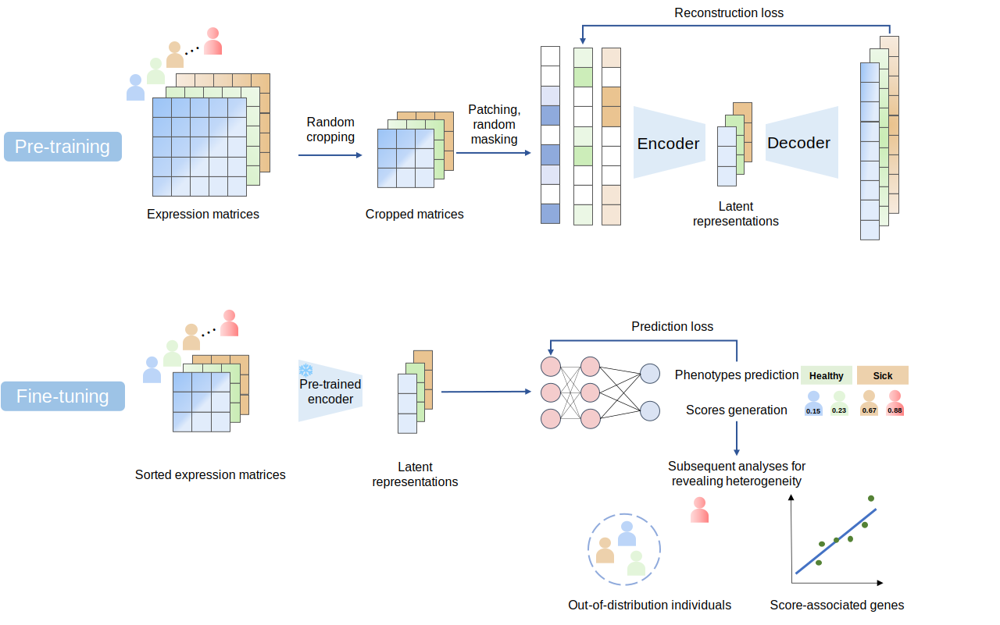

# scHILL
scHILL is developed to decipher individual-level immune cell heterogeneity with single-cell RNA sequencing data with masked autoencoder(MAE, Kaiming He et al.)

# Tutorial
__Step 1: Pre-training__ 
The codes used for pre-training were in [pre-train](./pre-train/). Please modify line 13 to your own work path. 
 
Two folders are needed in the work path, one is "h5ad", storing h5ad files, the other is "pretrain", storing the pretrained models. If your h5ad file is merged (one h5ad file containing neumerous samples), please split it first. 
 
__Step 2: Fine-tuning__ 
The codes used for fine-tuning were in [fine-tune](./fine-tune/). Please modify line 16 to your own work path. 
 
One folder and two files are needed in the work path, inclduing "tensors" to store transformed tensors, "label.csv" to provide labels, and "hvg.txt" to provide highly viriable genes. Step 2.1 transforms scRNA-seq expression matrices to tensors. Step 2.2 uses the tensors to perform phenotype prediction and score generation. 
 
__Expanding application:__ 
The models trained for JDM and cancer cases were used for processing tensors with the shape (N, 224, 224), and N could be any positive integer. This means that, to make scHILL fitting your data finer, you can crop your own scRNA-seq expression matrix into the different sizes (a×224 cells, b×224 genes), where a×b=N. In our study, we set a=1 and b=1 in the JDM case; a=1 and b=3 in the cancer case. The models trained for the COVID-19 case were used for processing tensors with the shape (N, 448, 448) so that you can crop your own expression matrix into (a×448 cells, b×448 genes). We set a=5 and b=5 in this study.
