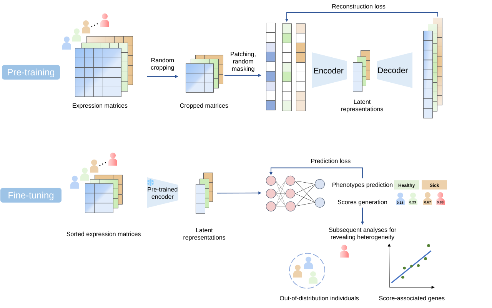

# scHILL
scHILL is developed to decipher individual-level immune cell heterogeneity with single-cell RNA sequencing data with masked autoencoder(MAE, Kaiming He et al.)

# Usage
__Step 1: Pre-training__ 
The codes used for pre-training were in [pre-train](./pre-train/).  
 
Two folders are needed in the work path, one is "h5ad", storing h5ad files, the other is "pretrain", storing the pretrained models. If your h5ad file is merged (one h5ad file containing neumerous samples), please split it first. 
 
__Step 2: Fine-tuning__ 
The codes used for fine-tuning were in [fine-tune](./fine-tune/).  
 
Step 2.1 transforms scRNA-seq expression matrices to tensors, and "hvg" file providing highly viriable genes is necessary. Step 2.2 uses the tensors to perform phenotype prediction and score generation, and "label.csv" providing phenotype labels is necessary. The outputs of Step 2.2 contain score for each individual, high-impact genes, and high-impcat cells. 
 
__Expanding application:__ 
scHILL were used for processing tensors with the shape (a x b, SIZE, SIZE), and 'N = a x b' could be any positive integer. scHILL can automatically identify an optimic N for different datasets. The models trained for the COVID-19 case were used for processing tensors with the shape (N, 448, 448) and we set a in range(1,5) and b in range(1,5) in this study. The models trained for the JDM case and cancer case were used for processing tensors with the shape (N, 224, 224)
